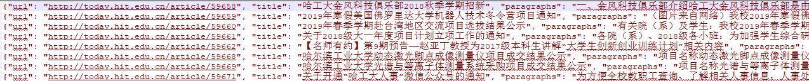
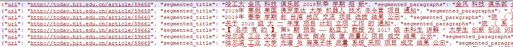
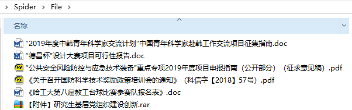

# 网页文本的预处理
任务：爬虫抓取网页，网页正文提取，附件下载，分词处理，停用词处理，json文件写入等

## 环境
	python 3.6.1
	Scrapy==1.6.0
	redis==3.2.1
	scrapy_redis==0.6.8
	pyltp==0.2.1
	w3lib==1.20.0

## 爬虫框架
- scrapy
- scrapy-redis

## 爬取网页

今日哈工大[公告公示栏目](http://today.hit.edu.cn/category/10) 下的文章以及其中的附件。

## 分词

采用哈工大 [LTP](https://github.com/HIT-SCIR/ltp) 的python版本 [pyltp](https://github.com/HIT-SCIR/pyltp)。

## 结果

分词前

分词后

附件

